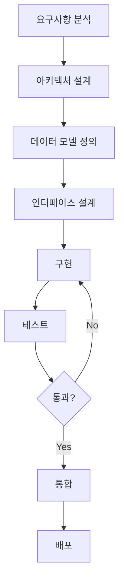

# ArBot 프로젝트 재개발 가이드 - CLAUDE.md

> **목적**: 기존 ArBot 프로젝트를 분석하여 새로운 암호화폐 차익거래 봇을 Claude Code와 함께 개발하기 위한 완전한 참고 문서

---

## 📋 목차

1. [프로젝트 개요](#프로젝트-개요)
2. [핵심 아키텍처](#핵심-아키텍처)
3. [주요 컴포넌트 상세](#주요-컴포넌트-상세)
4. [데이터 구조 및 흐름](#데이터-구조-및-흐름)
5. [알려진 문제점 및 개선사항](#알려진-문제점-및-개선사항)
6. [새 프로젝트 개발 권장사항](#새-프로젝트-개발-권장사항)
7. [기술 스택 및 의존성](#기술-스택-및-의존성)

---

## 프로젝트 개요

### 목적
ArBot은 다중 암호화폐 거래소 간의 가격 차이를 실시간으로 모니터링하고, 차익거래 기회를 자동으로 실행하는 시스템입니다.

### 핵심 기능
- **실시간 가격 모니터링**: WebSocket을 통한 저지연 가격 수집
- **차익거래 감지**: 거래소 간 스프레드 계산 및 수익성 분석
- **자동 주문 실행**: 실거래 및 시뮬레이션 모드
- **리스크 관리**: 최대 손실 제한, 동시 거래 수 제한
- **데이터 저장**: SQLite 기반 거래 이력 및 성과 추적
- **GUI/TUI**: Tkinter 및 Textual 기반 사용자 인터페이스

### 지원 거래소
- Binance (바이낸스)
- Bybit (바이비트)
- OKX
- Bitget (비트겟)
- Upbit (업비트) - 한국 지역 특화

---

## 핵심 아키텍처

### 전체 구조
```
┌─────────────────────────────────────────────────────────────┐
│                       ArBot Main (main.py)                   │
│  ┌──────────────┐  ┌──────────────┐  ┌─────────────────┐   │
│  │   Config     │  │   Database   │  │   Exchanges     │   │
│  └──────────────┘  └──────────────┘  └─────────────────┘   │
└─────────────────────────────────────────────────────────────┘
                             │
        ┌────────────────────┼────────────────────┐
        │                    │                    │
┌───────▼────────┐  ┌────────▼────────┐  ┌───────▼────────┐
│   Strategy     │  │   Trader/Sim    │  │      GUI       │
│  (차익거래 전략) │  │  (주문 실행)     │  │  (UI 표시)      │
└────────────────┘  └─────────────────┘  └────────────────┘
        │                    │                    │
        └────────────────────┴────────────────────┘
                             │
                      WebSocket Feeds
                             │
        ┌────────────────────┴────────────────────┐
        │                                         │
   ┌────▼────┐  ┌────────┐  ┌────────┐  ┌────────▼──┐
   │ Binance │  │ Bybit  │  │  OKX   │  │  Upbit    │
   └─────────┘  └────────┘  └────────┘  └───────────┘
```

### 디렉토리 구조
```
arbot/
├── arbot/                    # 메인 소스 패키지
│   ├── __init__.py
│   ├── main.py              # 진입점 및 오케스트레이션
│   ├── config.py            # 설정 관리 (JSON + 환경변수)
│   ├── database.py          # SQLite ORM 레이어
│   ├── strategy.py          # 차익거래 로직
│   ├── trader.py            # 실거래 실행
│   ├── simulator.py         # 시뮬레이션 모드
│   ├── backtester.py        # 백테스팅 엔진
│   ├── gui.py               # Tkinter GUI
│   ├── ui.py                # Textual TUI (deprecated)
│   ├── technical_indicators.py  # 기술적 지표
│   └── exchanges/           # 거래소 어댑터
│       ├── base.py          # 추상 베이스 클래스
│       ├── binance.py       # Binance 구현
│       ├── bybit.py         # Bybit 구현
│       ├── okx.py           # OKX 구현
│       ├── bitget.py        # Bitget 구현
│       └── upbit.py         # Upbit 구현
├── tests/                   # 유닛/통합 테스트
├── scripts/                 # 디버그/유틸리티 스크립트
├── data/                    # 데이터 저장소
│   └── arbot.db            # SQLite 데이터베이스
├── config.json             # 메인 설정 파일
├── config.local.json       # 로컬 오버라이드 설정
├── .env                    # 환경 변수 (API 키)
└── requirements.txt        # Python 의존성
```

---

## 주요 컴포넌트 상세

### 1. Configuration System (config.py)

#### 설계 패턴
- **계층적 설정**: config.json (기본) + config.local.json (오버라이드) + 환경변수 (.env)
- **타입 안전성**: dataclass 기반 설정 구조
- **동적 로드**: 런타임 설정 변경 가능

#### 주요 설정 클래스
```python
@dataclass
class ExchangeConfig:
    name: str
    api_key: str
    api_secret: str
    testnet: bool = False
    enabled: bool = True
    arbitrage_enabled: bool = True
    region: str = "global"
    premium_baseline: float = 0.0
    maker_fee: float = 0.001
    taker_fee: float = 0.001

@dataclass
class ArbitrageConfig:
    min_profit_threshold: float = 0.001  # 0.1%
    max_position_size: float = 1000.0
    max_symbols: int = 200
    slippage_tolerance: float = 0.001
    max_spread_age_seconds: float = 5.0
    use_dynamic_symbols: bool = True
    max_spread_threshold: float = 1.0
    enabled_quote_currencies: List[str] = ["USDT"]
```

#### 설정 우선순위
1. 환경변수 (.env) - 최우선
2. config.local.json - 로컬 오버라이드
3. config.json - 기본 설정

### 2. Database Layer (database.py)

#### 스키마 설계
```sql
-- 티커 데이터 (실시간 가격 스냅샷)
CREATE TABLE tickers (
    id INTEGER PRIMARY KEY,
    exchange TEXT NOT NULL,
    symbol TEXT NOT NULL,
    bid REAL NOT NULL,
    ask REAL NOT NULL,
    bid_size REAL,
    ask_size REAL,
    timestamp REAL NOT NULL,
    created_at TIMESTAMP DEFAULT CURRENT_TIMESTAMP
);

-- 거래 기록
CREATE TABLE trades (
    id INTEGER PRIMARY KEY,
    symbol TEXT NOT NULL,
    buy_exchange TEXT NOT NULL,
    sell_exchange TEXT NOT NULL,
    buy_price REAL NOT NULL,
    sell_price REAL NOT NULL,
    quantity REAL NOT NULL,
    profit REAL NOT NULL,
    profit_percent REAL NOT NULL,
    status TEXT DEFAULT 'pending',
    timestamp REAL NOT NULL
);

-- 차익거래 기회 로그
CREATE TABLE arbitrage_opportunities (
    id INTEGER PRIMARY KEY,
    symbol TEXT NOT NULL,
    buy_exchange TEXT NOT NULL,
    sell_exchange TEXT NOT NULL,
    buy_price REAL NOT NULL,
    sell_price REAL NOT NULL,
    profit REAL NOT NULL,
    profit_percent REAL NOT NULL,
    executed BOOLEAN DEFAULT FALSE,
    timestamp REAL NOT NULL
);

-- 잔고 스냅샷
CREATE TABLE balances (
    id INTEGER PRIMARY KEY,
    exchange TEXT NOT NULL,
    asset TEXT NOT NULL,
    free REAL NOT NULL,
    locked REAL NOT NULL,
    total REAL NOT NULL,
    usd_value REAL,
    timestamp REAL NOT NULL
);
```

#### 핵심 기능
- **배치 삽입**: 성능을 위한 일괄 처리 (`insert_tickers_batch`)
- **자동 정리**: 오래된 데이터 자동 삭제 (`cleanup_old_data`)
- **비동기 I/O**: aiosqlite를 사용한 비차단 데이터베이스 작업
- **인덱스 최적화**: 자주 쿼리되는 컬럼에 인덱스 생성

### 3. Exchange Adapters (exchanges/)

#### Base Exchange Interface (base.py)
```python
class BaseExchange(ABC):
    @abstractmethod
    async def connect_ws(self, symbols: List[str]) -> None:
        """WebSocket 구독"""

    @abstractmethod
    async def get_ticker(self, symbol: str) -> Ticker:
        """실시간 가격 조회"""

    @abstractmethod
    async def place_order(...) -> Order:
        """주문 실행"""

    @abstractmethod
    async def get_balance(...) -> Dict[str, Balance]:
        """잔고 조회"""

    # 콜백 시스템
    def on_ticker(self, callback: callable):
        """티커 업데이트 콜백 등록"""

    async def _emit_ticker(self, ticker: Ticker):
        """티커 이벤트 발생"""
```

#### Binance 구현 특징
- **스트림 제한**: 단일 연결당 최대 200 스트림
- **메시지 포맷**: Combined stream (`{"stream": "...", "data": {...}}`)
- **인증**: HMAC SHA256 서명
- **시간 동기화**: 서버 시간 오프셋 관리 (`_server_time_offset`)

#### Bybit 구현 특징
- **V5 API**: 최신 Bybit API 사용
- **심볼 제한**: 한 번에 구독 가능한 심볼 수 제한
- **인증 헤더**: X-BAPI-* 헤더 사용
- **에러 핸들링**: Invalid symbol 정규식 파싱

#### Upbit 특화 사항
- **한국 시장**: KRW 페어 지원
- **김치 프리미엄**: regional_premiums 설정
- **bid/ask 추정**: 실시간 거래가 기반 bid/ask 계산
- **WebSocket 제한**: 최대 100 심볼

### 4. Arbitrage Strategy (strategy.py)

#### 핵심 로직
```python
class ArbitrageStrategy:
    async def _check_arbitrage_opportunities(self, symbol: str):
        """차익거래 기회 감지"""
        # 1. 모든 거래소의 최신 가격 수집
        # 2. 거래소 쌍별로 스프레드 계산
        # 3. 수수료 및 슬리피지 고려
        # 4. 최소 이익 임계값 확인
        # 5. 신호 생성 및 콜백 호출

    async def _calculate_arbitrage(...) -> ArbitrageSignal:
        """차익거래 수익성 계산"""
        # buy_price (ask) vs sell_price (bid)
        # net_profit = gross_profit - fees - slippage
        # profit_percent = net_profit / buy_price
```

#### 수익성 계산 공식
```python
# 매수가: ask price (더 높은 가격에 산다)
buy_price = buy_exchange.ticker.ask
buy_fee = buy_price * taker_fee

# 매도가: bid price (더 낮은 가격에 판다)
sell_price = sell_exchange.ticker.bid
sell_fee = sell_price * taker_fee

# 순이익
gross_profit = sell_price - buy_price
fee_cost = buy_fee + sell_fee
slippage_cost = buy_price * slippage_tolerance
net_profit = gross_profit - fee_cost - slippage_cost

# 수익률
profit_percent = net_profit / buy_price
```

#### 필터링 메커니즘
1. **최소 이익 임계값**: `min_profit_threshold` (기본 0.1%)
2. **최대 스프레드 임계값**: `max_spread_threshold` (이상치 필터링)
3. **데이터 신선도**: `max_spread_age_seconds` (기본 5초)
4. **프리미엄 감지**: 지역별 프리미엄 조정 (선택적)
5. **쿨다운**: 동일 기회 재거래 방지 (60초)

### 5. Trading Execution

#### Live Trader (trader.py)
```python
class LiveTrader:
    async def execute_arbitrage(self, signal: ArbitrageSignal):
        """실거래 실행"""
        # 1. 리스크 체크 (잔고, 최대 드로다운)
        # 2. 거래 크기 계산
        # 3. 매수 주문 실행
        # 4. 매도 주문 실행
        # 5. 주문 모니터링 및 상태 업데이트
        # 6. 데이터베이스 기록
```

#### Simulator (simulator.py)
```python
class TradingSimulator:
    """가상 주문 시뮬레이션"""
    # - 초기 잔고: 거래소당 $10,000
    # - 슬리피지 시뮬레이션
    # - 부분 체결 확률 10%
    # - 주문 거부 확률 5%
    # - 체결 지연 2초
```

### 6. GUI Implementation (gui.py)

#### Tkinter 기반 UI
- **실시간 가격 디스플레이**: 거래소별 가격 및 스프레드
- **이동평균선**: 30초 이동평균 및 트렌드 표시
- **차익거래 기회**: 정렬 가능한 테이블
- **거래 이력**: 실시간 거래 로그
- **잔고 표시**: 거래소별 자산 현황
- **배치 업데이트**: 성능을 위한 일괄 UI 갱신

#### 비동기 이벤트 루프 통합
```python
class ArBotGUI:
    def start_async_loop(self):
        """별도 스레드에서 asyncio 이벤트 루프 실행"""
        self.event_loop = asyncio.new_event_loop()
        thread = threading.Thread(target=self._run_event_loop)
        thread.daemon = True
        thread.start()
```

---

## 데이터 구조 및 흐름

### 핵심 데이터 클래스

```python
@dataclass
class Ticker:
    """거래소 티커 데이터"""
    symbol: str
    bid: float          # 매수 호가 (낮음)
    ask: float          # 매도 호가 (높음)
    bid_size: float
    ask_size: float
    timestamp: float

@dataclass
class ArbitrageSignal:
    """차익거래 신호"""
    symbol: str
    buy_exchange: str
    sell_exchange: str
    buy_price: float    # ask price
    sell_price: float   # bid price
    profit: float
    profit_percent: float
    buy_size: float
    sell_size: float
    timestamp: float
    confidence: float   # 0.0 ~ 1.0

@dataclass
class Order:
    """주문 정보"""
    order_id: str
    symbol: str
    side: OrderSide     # BUY / SELL
    type: OrderType     # MARKET / LIMIT
    quantity: float
    price: Optional[float]
    status: OrderStatus
    filled_quantity: float
    average_price: Optional[float]
```

### 데이터 흐름도

```
┌─────────────────────────────────────────────────────────────┐
│  1. WebSocket 가격 수신                                       │
│     Exchange API → BaseExchange._handle_ws_messages()        │
└─────────────────────────┬───────────────────────────────────┘
                          │
                          ▼
┌─────────────────────────────────────────────────────────────┐
│  2. 티커 정규화 및 이벤트 발생                                 │
│     BaseExchange._emit_ticker(ticker)                        │
└─────────────────────────┬───────────────────────────────────┘
                          │
                ┌─────────┴─────────┐
                │                   │
                ▼                   ▼
┌──────────────────────┐  ┌──────────────────────┐
│  3a. Strategy 콜백   │  │  3b. GUI 콜백        │
│  _on_ticker_update() │  │  _on_ticker_for_    │
│                      │  │  spreads/storage()   │
└──────────┬───────────┘  └──────────────────────┘
           │
           ▼
┌─────────────────────────────────────────────────────────────┐
│  4. 차익거래 기회 감지                                         │
│     _check_arbitrage_opportunities()                         │
│     - 거래소 쌍별 스프레드 계산                                │
│     - 수수료/슬리피지 계산                                     │
│     - 필터링 (임계값, 이상치)                                  │
└─────────────────────────┬───────────────────────────────────┘
                          │
                          ▼
┌─────────────────────────────────────────────────────────────┐
│  5. 신호 생성 및 저장                                         │
│     - ArbitrageSignal 생성                                   │
│     - Database.insert_arbitrage_opportunity()               │
│     - 신호 콜백 호출                                          │
└─────────────────────────┬───────────────────────────────────┘
                          │
                          ▼
┌─────────────────────────────────────────────────────────────┐
│  6. 주문 실행 (자동 거래 활성화 시)                            │
│     LiveTrader.execute_arbitrage() 또는                      │
│     TradingSimulator.execute_arbitrage()                    │
└─────────────────────────┬───────────────────────────────────┘
                          │
                          ▼
┌─────────────────────────────────────────────────────────────┐
│  7. 주문 모니터링 및 완료                                      │
│     - 주문 상태 추적                                          │
│     - 체결 확인                                              │
│     - TradeRecord 생성 및 저장                                │
│     - 성과 통계 업데이트                                       │
└─────────────────────────────────────────────────────────────┘
```

---

## 알려진 문제점 및 개선사항

### 현재 프로젝트의 주요 문제점

#### 1. WebSocket 안정성
**문제:**
- 연결 끊김 시 재연결 로직 복잡도 증가
- 거래소별 WebSocket 제한 (심볼 수, 메시지 레이트)
- Binance: 200 스트림 제한
- Bybit: 구독 실패 시 에러 핸들링
- Upbit: 100 심볼 제한

**개선 방향:**
```python
# 단순화된 재연결 로직
async def connect_ws_with_retry(max_retries=3, base_delay=5):
    for attempt in range(max_retries):
        try:
            await connect_ws()
            return
        except Exception as e:
            if attempt < max_retries - 1:
                await asyncio.sleep(base_delay * (2 ** attempt))
            else:
                raise
```

#### 2. 데이터베이스 성능
**문제:**
- 티커 데이터 개별 삽입으로 인한 오버헤드
- 인덱스 부족으로 쿼리 속도 저하
- 오래된 데이터 정리 메커니즘 부재

**개선 방향:**
```python
# 배치 삽입 최적화
async def insert_tickers_batch(self, tickers: List[TickerRecord], batch_size=100):
    """최적화된 배치 삽입"""
    for i in range(0, len(tickers), batch_size):
        batch = tickers[i:i+batch_size]
        await self._insert_batch(batch)

# 파티셔닝
CREATE TABLE tickers_2024_01 PARTITION OF tickers
FOR VALUES FROM ('2024-01-01') TO ('2024-02-01');
```

#### 3. 설정 관리 복잡도
**문제:**
- config.json + config.local.json + .env 3단계 오버라이드
- 설정 변경 시 재시작 필요
- 타입 검증 부족

**개선 방향:**
```python
# Pydantic 기반 설정
from pydantic import BaseSettings, validator

class Settings(BaseSettings):
    binance_api_key: str
    min_profit_threshold: float = 0.001

    @validator('min_profit_threshold')
    def validate_threshold(cls, v):
        if v <= 0 or v >= 1:
            raise ValueError('Threshold must be between 0 and 1')
        return v

    class Config:
        env_file = '.env'
        case_sensitive = False
```

#### 4. 에러 핸들링
**문제:**
- 거래소 API 에러 시 전체 프로세스 중단
- 네트워크 일시 장애 복구 메커니즘 부족
- 로깅 불충분

**개선 방향:**
```python
# 서킷 브레이커 패턴
class CircuitBreaker:
    def __init__(self, failure_threshold=5, timeout=60):
        self.failure_count = 0
        self.failure_threshold = failure_threshold
        self.timeout = timeout
        self.last_failure_time = None
        self.state = "closed"  # closed, open, half-open

    async def call(self, func, *args, **kwargs):
        if self.state == "open":
            if time.time() - self.last_failure_time > self.timeout:
                self.state = "half-open"
            else:
                raise Exception("Circuit breaker is open")

        try:
            result = await func(*args, **kwargs)
            if self.state == "half-open":
                self.state = "closed"
                self.failure_count = 0
            return result
        except Exception as e:
            self.failure_count += 1
            self.last_failure_time = time.time()
            if self.failure_count >= self.failure_threshold:
                self.state = "open"
            raise
```

#### 5. 동시성 및 성능
**문제:**
- GUI 업데이트가 메인 스레드를 블로킹
- 비동기 코드와 동기 코드 혼재
- 메모리 누수 가능성 (WebSocket 연결 정리 불완전)

**개선 방향:**
```python
# 비동기 큐 기반 GUI 업데이트
class AsyncGUIUpdater:
    def __init__(self):
        self.update_queue = asyncio.Queue(maxsize=1000)

    async def producer(self, data):
        """비동기 데이터 생산"""
        await self.update_queue.put(data)

    def consumer(self):
        """GUI 스레드에서 소비"""
        try:
            data = self.update_queue.get_nowait()
            self.update_ui(data)
        except asyncio.QueueEmpty:
            pass
        self.root.after(100, self.consumer)
```

#### 6. 테스트 커버리지
**문제:**
- 유닛 테스트 부족
- 통합 테스트 없음
- 모킹 불충분

**개선 방향:**
```python
# pytest + pytest-asyncio
@pytest.mark.asyncio
async def test_arbitrage_calculation():
    strategy = ArbitrageStrategy(config, db)

    # Mock exchange data
    buy_ticker = Ticker(symbol="BTCUSDT", ask=50000, ...)
    sell_ticker = Ticker(symbol="BTCUSDT", bid=50100, ...)

    signal = await strategy._calculate_arbitrage(
        ExchangeData("binance", buy_ticker, ...),
        ExchangeData("bybit", sell_ticker, ...)
    )

    assert signal.profit_percent > 0
    assert signal.buy_exchange == "binance"
```

### 7. 보안 취약점
**문제:**
- API 키 평문 저장 가능성
- SQL injection 가능성 (aiosqlite는 안전하지만)
- 로그에 민감 정보 노출

**개선 방향:**
```python
# API 키 암호화
from cryptography.fernet import Fernet

class SecureConfig:
    def __init__(self):
        self.cipher = Fernet(os.getenv("ENCRYPTION_KEY"))

    def encrypt_api_key(self, key: str) -> str:
        return self.cipher.encrypt(key.encode()).decode()

    def decrypt_api_key(self, encrypted: str) -> str:
        return self.cipher.decrypt(encrypted.encode()).decode()

# 로그 필터링
class SensitiveDataFilter(logging.Filter):
    def filter(self, record):
        # API 키, 시크릿 필터링
        record.msg = re.sub(r'api_key=\w+', 'api_key=***', record.msg)
        return True
```

---

## 새 프로젝트 개발 권장사항

### 설계 원칙

#### 1. 단순성 우선 (KISS)
```python
# ❌ 복잡한 상속 구조
class ComplexExchange(BaseExchange, RateLimiter, Authenticator):
    pass

# ✅ 조합 우선
class SimpleExchange(BaseExchange):
    def __init__(self):
        self.rate_limiter = RateLimiter()
        self.auth = Authenticator()
```

#### 2. 명확한 책임 분리 (SRP)
```python
# ❌ 하나의 클래스가 너무 많은 역할
class ArBot:
    def connect_exchanges(self): ...
    def calculate_arbitrage(self): ...
    def execute_trades(self): ...
    def update_gui(self): ...
    def store_data(self): ...

# ✅ 각각 별도 클래스로 분리
class ExchangeManager: ...
class ArbitrageCalculator: ...
class TradeExecutor: ...
class GUIManager: ...
class DataStore: ...
```

#### 3. 의존성 주입
```python
# ❌ 하드코딩된 의존성
class Strategy:
    def __init__(self):
        self.db = Database("arbot.db")
        self.exchange = BinanceExchange()

# ✅ 의존성 주입
class Strategy:
    def __init__(self, db: Database, exchange: BaseExchange):
        self.db = db
        self.exchange = exchange
```

#### 4. 타입 힌팅 철저히
```python
from typing import Optional, List, Dict, Union, Protocol

class Exchange(Protocol):
    async def get_ticker(self, symbol: str) -> Ticker: ...
    async def place_order(self, order: Order) -> OrderResult: ...

def calculate_profit(
    buy_price: float,
    sell_price: float,
    fees: Dict[str, float]
) -> Optional[float]:
    """수익 계산"""
    ...
```

### 권장 아키텍처

#### 레이어드 아키텍처
```
┌─────────────────────────────────────────────┐
│  Presentation Layer (GUI/API)               │
│  - Tkinter/FastAPI                          │
│  - 사용자 입력 처리                          │
│  - 데이터 표시                               │
└─────────────────┬───────────────────────────┘
                  │
┌─────────────────▼───────────────────────────┐
│  Application Layer (Use Cases)              │
│  - 차익거래 워크플로우                        │
│  - 거래 실행 워크플로우                       │
│  - 백테스팅 워크플로우                        │
└─────────────────┬───────────────────────────┘
                  │
┌─────────────────▼───────────────────────────┐
│  Domain Layer (Business Logic)              │
│  - ArbitrageCalculator                      │
│  - RiskManager                              │
│  - PriceAnalyzer                            │
└─────────────────┬───────────────────────────┘
                  │
┌─────────────────▼───────────────────────────┐
│  Infrastructure Layer                       │
│  - ExchangeAdapters                         │
│  - DatabaseRepository                       │
│  - WebSocketManager                         │
└─────────────────────────────────────────────┘
```

#### 이벤트 기반 아키텍처
```python
class EventBus:
    """중앙 이벤트 버스"""
    def __init__(self):
        self.subscribers: Dict[str, List[Callable]] = defaultdict(list)

    def subscribe(self, event_type: str, handler: Callable):
        self.subscribers[event_type].append(handler)

    async def publish(self, event_type: str, data: Any):
        for handler in self.subscribers[event_type]:
            await handler(data)

# 사용 예
event_bus = EventBus()

# 구독자
event_bus.subscribe("ticker_update", strategy.on_ticker)
event_bus.subscribe("ticker_update", gui.update_price)
event_bus.subscribe("arbitrage_signal", trader.execute)

# 발행자
await event_bus.publish("ticker_update", ticker)
```

### 필수 기능 체크리스트

#### Phase 1: MVP (Minimum Viable Product)
- [ ] **거래소 연결**
  - [ ] Binance WebSocket 연결
  - [ ] Bybit WebSocket 연결
  - [ ] 가격 데이터 수신 및 파싱

- [ ] **차익거래 감지**
  - [ ] 거래소 간 스프레드 계산
  - [ ] 수수료 고려
  - [ ] 최소 이익 임계값 필터링

- [ ] **데이터 저장**
  - [ ] SQLite 스키마 생성
  - [ ] 티커 데이터 저장
  - [ ] 차익거래 기회 로깅

- [ ] **기본 UI**
  - [ ] 실시간 가격 표시
  - [ ] 차익거래 기회 목록
  - [ ] 시작/중지 버튼

#### Phase 2: 고급 기능
- [ ] **자동 거래**
  - [ ] 주문 실행 로직
  - [ ] 주문 상태 추적
  - [ ] 체결 확인

- [ ] **리스크 관리**
  - [ ] 잔고 확인
  - [ ] 최대 드로다운 제한
  - [ ] 포지션 크기 계산

- [ ] **백테스팅**
  - [ ] 과거 데이터 재생
  - [ ] 성과 분석
  - [ ] 리포트 생성

- [ ] **모니터링 및 알림**
  - [ ] 로깅 시스템
  - [ ] 에러 알림
  - [ ] 성과 대시보드

#### Phase 3: 프로덕션 준비
- [ ] **안정성**
  - [ ] 재연결 로직
  - [ ] 서킷 브레이커
  - [ ] 우아한 종료

- [ ] **보안**
  - [ ] API 키 암호화
  - [ ] 로그 필터링
  - [ ] 레이트 리미팅

- [ ] **성능**
  - [ ] 데이터베이스 인덱싱
  - [ ] 배치 처리
  - [ ] 메모리 최적화

- [ ] **테스트**
  - [ ] 유닛 테스트 (80%+ 커버리지)
  - [ ] 통합 테스트
  - [ ] 엔드투엔드 테스트

### 개발 워크플로우



#### 1. 요구사항 분석
- 지원할 거래소 목록
- 거래 전략 (차익거래, 삼각거래 등)
- 성능 요구사항 (지연시간, 처리량)
- 보안 요구사항

#### 2. 아키텍처 설계
- 컴포넌트 다이어그램 작성
- 데이터 흐름도 작성
- 기술 스택 선택
- 배포 전략 수립

#### 3. 구현 순서
```
1. 데이터 모델 및 타입 정의
2. 데이터베이스 스키마 생성
3. 거래소 어댑터 구현 (가장 중요)
4. 차익거래 로직 구현
5. UI 구현
6. 자동 거래 기능 구현
7. 백테스팅 기능 구현
8. 모니터링 및 로깅 추가
```

---

## 기술 스택 및 의존성

### 핵심 라이브러리

#### 비동기 I/O
```toml
[dependencies]
asyncio = "built-in"      # 비동기 런타임
aiohttp = "^3.9.0"        # 비동기 HTTP 클라이언트
websockets = "^12.0"      # WebSocket 클라이언트
aiosqlite = "^0.19.0"     # 비동기 SQLite
```

#### 데이터 처리
```toml
pandas = "^2.1.0"         # 데이터 분석
numpy = "^1.26.0"         # 수치 계산
python-dateutil = "^2.8.2"  # 날짜 처리
```

#### GUI/UI
```toml
tkinter = "built-in"      # GUI (기본)
textual = "^0.40.0"       # TUI (대안)
rich = "^13.5.0"          # 터미널 출력 포맷팅
```

#### 설정 및 환경
```toml
python-dotenv = "^1.0.0"  # 환경변수 로드
pydantic = "^2.4.0"       # 설정 검증 (권장)
```

#### 암호화 및 보안
```toml
cryptography = "^41.0.0"  # API 키 암호화
```

#### 테스트
```toml
pytest = "^7.4.0"         # 테스팅 프레임워크
pytest-asyncio = "^0.21.0"  # 비동기 테스트
pytest-cov = "^4.1.0"     # 코드 커버리지
pytest-mock = "^3.11.0"   # 모킹
```

#### 코드 품질
```toml
black = "^23.9.0"         # 코드 포맷터
mypy = "^1.5.0"           # 정적 타입 체커
ruff = "^0.0.291"         # 린터
```

### 거래소 API 라이브러리

#### 공식 SDK (선택사항)
```toml
python-binance = "^1.0.19"  # Binance 공식
pybit = "^5.5.0"            # Bybit 공식
okx = "^1.0.0"              # OKX 공식
```

**주의**: 공식 SDK는 편리하지만 버그나 업데이트 지연이 있을 수 있음. 직접 REST/WebSocket 구현도 고려.

### Python 버전 및 환경
```toml
[tool.poetry]
python = "^3.10"  # 최소 3.10 (match-case 문법 등)

[tool.poetry.dev-dependencies]
ipython = "^8.15.0"        # REPL
jupyter = "^1.0.0"         # 노트북 분석
```

### 데이터베이스 선택

#### SQLite (현재)
**장점:**
- 파일 기반, 설치 불필요
- 경량, 빠른 읽기
- Python 내장

**단점:**
- 동시 쓰기 제한
- 확장성 제한

#### PostgreSQL (권장 - 프로덕션)
```toml
asyncpg = "^0.28.0"       # 비동기 PostgreSQL
sqlalchemy = "^2.0.0"     # ORM (선택)
alembic = "^1.12.0"       # 마이그레이션
```

**장점:**
- 고성능, 확장 가능
- 동시성 우수
- 고급 쿼리 기능

#### TimescaleDB (시계열 데이터)
```toml
# PostgreSQL + TimescaleDB 확장
timescaledb = "extension"
```

**장점:**
- 시계열 데이터 최적화
- 자동 파티셔닝
- 압축 및 집계

### 배포 및 운영

#### Docker
```dockerfile
FROM python:3.11-slim

WORKDIR /app
COPY requirements.txt .
RUN pip install --no-cache-dir -r requirements.txt

COPY . .
CMD ["python", "-m", "arbot.main"]
```

#### Docker Compose
```yaml
version: '3.8'
services:
  arbot:
    build: .
    env_file: .env
    volumes:
      - ./data:/app/data
    restart: unless-stopped

  postgres:
    image: timescale/timescaledb:latest-pg15
    environment:
      POSTGRES_DB: arbot
      POSTGRES_USER: arbot
      POSTGRES_PASSWORD: ${DB_PASSWORD}
    volumes:
      - pgdata:/var/lib/postgresql/data
```

#### 모니터링
```toml
prometheus-client = "^0.17.0"  # 메트릭 수집
sentry-sdk = "^1.32.0"         # 에러 추적
```

---

## Claude Code와 함께 개발하기

### 프롬프트 예시

#### 초기 설정
```
ArBot 차익거래 봇을 새로 개발하려고 합니다.
다음 기능이 필요합니다:
1. Binance와 Bybit WebSocket 연결
2. 실시간 가격 차이 모니터링
3. SQLite 데이터 저장
4. 간단한 Tkinter GUI

먼저 프로젝트 구조를 생성하고,
BaseExchange 추상 클래스를 정의해주세요.
```

#### 거래소 구현
```
BinanceExchange 클래스를 구현해주세요.
요구사항:
- BaseExchange 상속
- WebSocket을 통한 ticker 스트림 구독
- HMAC SHA256 인증
- 재연결 로직 포함
- 최대 200 스트림 제한 고려

참고: NEW_PROJECT_GUIDE.md의 Binance 구현 특징 섹션 참조
```

#### 차익거래 로직
```
ArbitrageCalculator 클래스를 구현해주세요.
입력: 두 거래소의 Ticker 객체
출력: ArbitrageSignal (수익성 있는 경우만)

계산 로직:
- buy_price = ask (더 낮은 거래소)
- sell_price = bid (더 높은 거래소)
- 수수료 및 슬리피지 고려
- 최소 이익 임계값 0.1% 적용

참고: NEW_PROJECT_GUIDE.md의 수익성 계산 공식 참조
```

### 디버깅 프롬프트
```
WebSocket 연결이 자주 끊기는 문제가 있습니다.
다음 로그를 분석하고 해결책을 제안해주세요:

[로그 내용 붙여넣기]

참고: NEW_PROJECT_GUIDE.md의 "WebSocket 안정성" 섹션 참조
```

### 코드 리뷰 프롬프트
```
다음 코드를 리뷰해주세요:
- 버그 가능성
- 성능 이슈
- 보안 취약점
- 코드 스타일

[코드 붙여넣기]

참고: NEW_PROJECT_GUIDE.md의 설계 원칙 준수 여부 확인
```

---

## 참고 자료

### 거래소 API 문서
- [Binance API](https://binance-docs.github.io/apidocs/)
- [Bybit API](https://bybit-exchange.github.io/docs/v5/intro)
- [OKX API](https://www.okx.com/docs-v5/)
- [Bitget API](https://www.bitget.com/api-doc/)
- [Upbit API](https://docs.upbit.com/)

### 기술 문서
- [Python asyncio](https://docs.python.org/3/library/asyncio.html)
- [WebSockets](https://websockets.readthedocs.io/)
- [aiohttp](https://docs.aiohttp.org/)
- [SQLite](https://www.sqlite.org/docs.html)

### 트레이딩 개념
- [Arbitrage Trading](https://www.investopedia.com/terms/a/arbitrage.asp)
- [Order Book Basics](https://www.investopedia.com/terms/o/order-book.asp)
- [Market Microstructure](https://en.wikipedia.org/wiki/Market_microstructure)

---

## 마무리

이 문서는 기존 ArBot 프로젝트를 분석하여 새로운 프로젝트를 개발할 때 참고할 수 있도록 작성되었습니다.

### 핵심 포인트
1. **단순성 우선**: 복잡한 구조보다 명확한 코드
2. **안정성**: 재연결, 에러 핸들링, 테스트
3. **성능**: 비동기, 배치 처리, 인덱싱
4. **보안**: API 키 암호화, 로그 필터링
5. **유지보수성**: 타입 힌팅, 문서화, 테스트

### 다음 단계
1. 이 문서를 기반으로 새 프로젝트 구조 생성
2. MVP 기능부터 구현 (거래소 연결 → 차익거래 감지 → UI)
3. 점진적으로 고급 기능 추가
4. 지속적인 테스트 및 리팩토링

**Happy Coding with Claude! 🚀**
