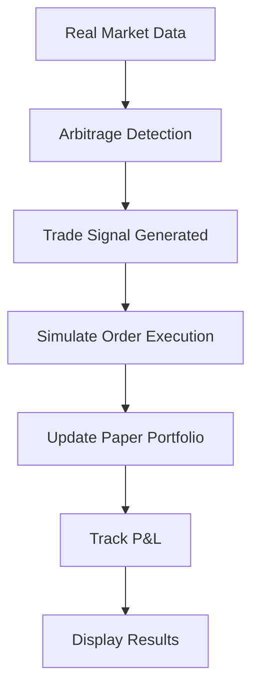
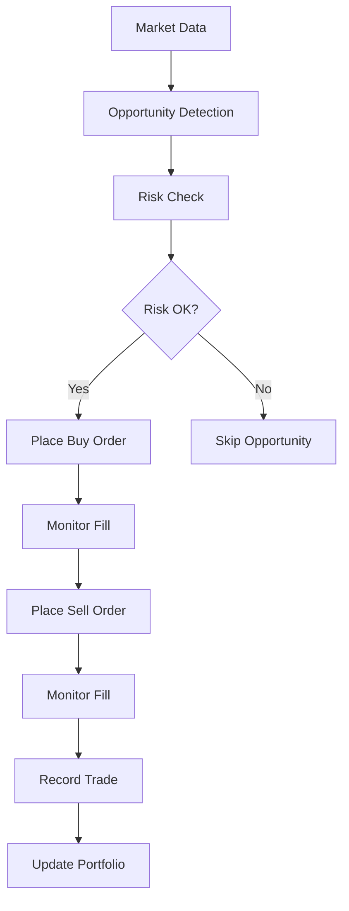

# Trading Modes

ArBot supports three distinct trading modes, each designed for different use cases and risk levels. Understanding these modes is crucial for successful arbitrage trading.

## Overview

| Mode | Purpose | Risk Level | API Keys Required | Real Money |
|------|---------|------------|------------------|------------|
| **Simulation** | Learning & Testing | None | No | No |
| **Live** | Real Trading | High | Yes | Yes |
| **Backtest** | Strategy Analysis | None | No | No |

## Simulation Mode

### Purpose and Use Cases

**Perfect for:**
- Learning how arbitrage works
- Testing configuration changes
- Evaluating strategies risk-free
- Training new users
- Debugging system issues

**What it does:**
- Uses real-time market data from exchanges
- Simulates trade execution with paper money
- Tracks hypothetical profit and loss
- Records all trading decisions

### How Simulation Works



**Data Flow:**
1. **Real Price Data**: Fetches live prices from exchanges
2. **Opportunity Detection**: Identifies arbitrage opportunities
3. **Simulated Execution**: Pretends to place orders
4. **Portfolio Tracking**: Updates virtual balance
5. **Performance Analysis**: Records results for analysis

### Simulation Features

**Realistic Trading Simulation**
- Uses actual bid/ask prices
- Includes trading fees in calculations
- Accounts for slippage estimates
- Respects minimum order sizes

**Paper Trading Benefits**
```python
# Example simulation trade
{
    "symbol": "BTCUSDT",
    "buy_exchange": "bybit",
    "sell_exchange": "binance",
    "buy_price": 43250.50,
    "sell_price": 43295.80,
    "quantity": 0.1,
    "gross_profit": 4.53,
    "fees": 0.86,
    "net_profit": 3.67,
    "profit_percent": 0.0085,
    "executed_at": "2024-01-15T10:30:45Z",
    "mode": "simulation"
}
```

### Configuration for Simulation

**Recommended Settings:**
```json
{
  "trading_mode": "simulation",
  "arbitrage": {
    "min_profit_threshold": 0.005,
    "trade_amount_usd": 100.0,
    "max_symbols": 100
  },
  "ui": {
    "refresh_rate_ms": 1000
  }
}
```

**No API Keys Required**
- Uses public market data only
- No authentication needed
- Works with exchange APIs read-only access

## Live Trading Mode

### Purpose and Use Cases

**Use when:**
- You have tested thoroughly in simulation
- You understand the risks involved
- You have proper API keys set up
- You're ready to trade with real money

!!! danger "High Risk Mode"
    Live mode trades with real money. Losses are real and can be significant. Only use after extensive testing in simulation mode.

### Prerequisites for Live Trading

**Technical Requirements:**
1. **Valid API Keys** for each exchange
2. **Sufficient Account Balance** on exchanges
3. **Stable Internet Connection** (low latency preferred)
4. **Proper Risk Management** settings configured

**API Key Permissions:**
```bash
# Required permissions per exchange
Binance: "Enable Reading", "Enable Spot & Margin Trading"
Bybit: "Read", "Trade"
OKX: "Read", "Trade"
Bitget: "Read Only", "Trade"
```

### Live Trading Flow



**Execution Process:**
1. **Opportunity Identification**: Find profitable spread
2. **Risk Validation**: Check all risk parameters
3. **Order Placement**: Submit real orders to exchanges
4. **Execution Monitoring**: Track order fills
5. **Profit Realization**: Complete arbitrage cycle
6. **Record Keeping**: Log all transactions

### Live Trading Features

**Real Order Execution**
- Places actual buy/sell orders
- Manages order lifecycle
- Handles partial fills
- Implements timeout mechanisms

**Risk Management Integration**
```python
# Live trading risk checks
def validate_trade(opportunity):
    checks = [
        check_balance_sufficient(),
        check_max_position_size(),
        check_concurrent_trade_limit(),
        check_max_drawdown(),
        check_api_connection(),
        check_market_conditions()
    ]
    return all(checks)
```

**Real-Time Portfolio Management**
- Tracks actual account balances
- Monitors open positions
- Calculates real P&L
- Updates risk metrics

### Configuration for Live Trading

**Critical Settings:**
```json
{
  "trading_mode": "live",
  "arbitrage": {
    "min_profit_threshold": 0.01,
    "trade_amount_usd": 100.0,
    "max_spread_age_seconds": 2.0,
    "use_trend_filter": true
  },
  "risk_management": {
    "max_drawdown_percent": 5.0,
    "stop_loss_percent": 2.0,
    "max_concurrent_trades": 3,
    "balance_threshold_percent": 10.0
  }
}
```

**Environment Variables:**
```bash
# Required for live trading
BINANCE_API_KEY=your_binance_key
BINANCE_API_SECRET=your_binance_secret
BYBIT_API_KEY=your_bybit_key
BYBIT_API_SECRET=your_bybit_secret
```

## Backtest Mode

### Purpose and Use Cases

**Ideal for:**
- Strategy development and validation
- Historical performance analysis
- Parameter optimization
- Risk assessment
- Academic research

**What it provides:**
- Historical performance metrics
- Strategy comparison capabilities
- Risk analysis over time
- Market condition sensitivity analysis

### Backtest Data Sources

**Database Source**
- Uses historical data stored in ArBot database
- Includes actual spreads and opportunities found
- Limited to periods when bot was running

**CSV Source**
- Import external historical data
- Support for OHLCV format
- Custom data preprocessing

### Backtest Configuration

**Basic Setup:**
```json
{
  "trading_mode": "backtest",
  "backtest": {
    "start_date": "2024-01-01",
    "end_date": "2024-03-31",
    "initial_balance": 10000.0,
    "data_source": "database"
  }
}
```

**Advanced Parameters:**
```json
{
  "backtest": {
    "start_date": "2024-01-01",
    "end_date": "2024-12-31",
    "initial_balance": 10000.0,
    "data_source": "csv",
    "csv_path": "data/historical_prices.csv",
    "commission": 0.001,
    "slippage": 0.0005,
    "market_impact": 0.0001
  }
}
```

### Backtest Features

**Comprehensive Analysis**
- Win/loss ratios
- Maximum drawdown
- Sharpe ratio calculation
- Monthly/quarterly performance
- Risk-adjusted returns

**Strategy Optimization**
```python
# Example backtest results
{
  "period": "2024-01-01 to 2024-03-31",
  "total_trades": 1247,
  "winning_trades": 1089,
  "losing_trades": 158,
  "win_rate": 87.3,
  "total_return": 24.6,
  "max_drawdown": 3.2,
  "sharpe_ratio": 2.1,
  "profit_factor": 3.8,
  "average_trade": 0.0197,
  "best_trade": 1.24,
  "worst_trade": -0.87
}
```

## Switching Between Modes

### Safe Mode Transitions

**Simulation → Live:**
1. ✅ Test extensively in simulation
2. ✅ Configure all risk parameters
3. ✅ Set up API keys and permissions
4. ✅ Start with small position sizes
5. ✅ Monitor closely for first few trades

**Live → Simulation:**
1. ✅ Stop all active trading
2. ✅ Wait for open positions to close
3. ✅ Switch mode in configuration
4. ✅ Restart application

**Any Mode → Backtest:**
1. ✅ Ensure historical data available
2. ✅ Configure date range
3. ✅ Set initial balance
4. ✅ Run analysis

### Mode-Specific Considerations

**Simulation Mode Best Practices:**
- Use realistic position sizes
- Test different market conditions
- Monitor for extended periods
- Validate all configuration changes

**Live Trading Best Practices:**
- Start with conservative settings
- Monitor constantly during initial period
- Have stop-loss mechanisms ready
- Keep detailed trading logs

**Backtest Mode Best Practices:**
- Use sufficient historical data
- Account for market regime changes
- Validate with out-of-sample data
- Consider transaction costs realistically

## Performance Comparison

### Expected Results by Mode

| Metric | Simulation | Live Trading | Backtest |
|--------|------------|--------------|----------|
| **Accuracy** | High | Moderate | Variable |
| **Execution** | Instant | Market-dependent | Instant |
| **Costs** | Estimated | Actual | Estimated |
| **Slippage** | Estimated | Actual | Estimated |
| **Market Impact** | None | Actual | Estimated |

### Factors Affecting Live Performance

**Network Latency:**
- Geographic distance to exchanges
- Internet connection quality
- VPS vs local execution

**Market Conditions:**
- Volatility levels
- Liquidity availability
- Competition from other arbitrageurs

**Execution Quality:**
- Order fill rates
- Slippage experienced
- Fee structures

## Troubleshooting by Mode

### Simulation Issues
- **No opportunities found**: Lower profit threshold
- **Unrealistic profits**: Check fee calculations
- **Performance issues**: Reduce max symbols

### Live Trading Issues
- **Orders not executing**: Check API permissions
- **High slippage**: Reduce position sizes
- **Connection errors**: Verify network stability

### Backtest Issues
- **No historical data**: Check data source
- **Incomplete results**: Verify date range
- **Performance discrepancies**: Review parameters

!!! tip "Mode Selection Guide"
    - **New users**: Start with Simulation
    - **Strategy testing**: Use Backtest + Simulation
    - **Production trading**: Live (after thorough testing)
    - **Research/analysis**: Backtest with historical data