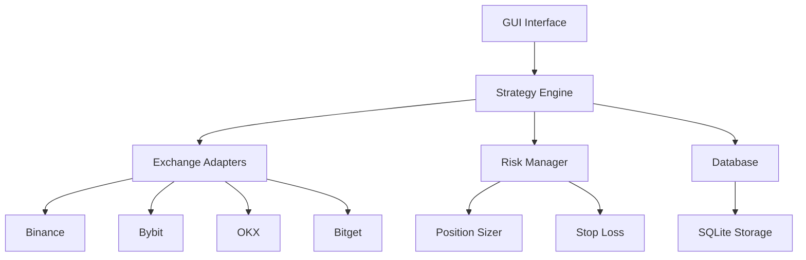

# ArBot - Arbitrage Trading Bot

**ArBot** is a modular, real-time arbitrage trading bot that monitors and exploits price spreads between multiple centralized cryptocurrency exchanges. It supports both real-time trading and simulation modes and is controlled via a modern tkinter-based GUI.

## 🚀 Key Features

### ⚡ Real-Time Arbitrage Detection
- **Multi-Exchange Monitoring**: Supports Binance, Bybit, OKX, and Bitget
- **Live Price Feeds**: WebSocket-based real-time data collection
- **Smart Spread Detection**: Configurable profit thresholds and spread filtering
- **Premium Detection**: Identifies exchange-specific pricing patterns

### 🎯 Advanced Trading Strategy
- **Trend-Based Filtering**: Only trade during favorable market conditions
- **Moving Average Analysis**: 30-second configurable moving averages
- **Quote Currency Filtering**: Focus on USDT, BUSD, USDC, BTC, ETH, BNB pairs
- **Dynamic Symbol Selection**: Auto-detect high-volume trading pairs

### 🖥️ Modern GUI Interface
- **Real-Time Dashboard**: Live price monitoring and spread visualization
- **Interactive Tables**: Sortable columns with visual indicators (↑↓)
- **Comprehensive Settings**: Easy configuration of all parameters
- **Trading History**: Track performance and executed trades

### 🛡️ Risk Management
- **Position Sizing**: Fixed or Kelly criterion-based sizing
- **Stop Loss**: Configurable stop-loss percentages
- **Drawdown Protection**: Maximum drawdown limits
- **Concurrent Trade Limits**: Control exposure across exchanges

### 🎮 Multiple Trading Modes
- **Live Trading**: Execute real trades with API integration
- **Simulation Mode**: Test strategies with live data but paper trades
- **Backtesting**: Historical data analysis and strategy validation

## 📊 Recent Updates

### UI Enhancements
- ✅ **Dynamic Symbol Management**: Monitor up to 200+ symbols (previously limited to 50)
- ✅ **Quote Currency Filtering**: Configurable filtering by quote currencies
- ✅ **Price Display Improvements**: New format "Price(±Diff)" for cleaner visualization
- ✅ **Column Sorting**: Interactive sorting with visual indicators
- ✅ **Moving Average Integration**: Real-time 30-second moving averages
- ✅ **Trend-Based Arbitrage**: Filter opportunities based on price trends

### Configuration Improvements
- ✅ **Settings Panel Overhaul**: No more overlapping rows, dynamic layout
- ✅ **Trend Filter Settings**: Configure uptrend/downtrend trading preferences
- ✅ **Enhanced Quote Options**: Support for multiple quote currencies
- ✅ **Premium Detection**: Advanced exchange premium analysis

## 🏗️ Architecture

## 📈 Performance Metrics

The bot continuously tracks:
- **Arbitrage Opportunities**: Real-time detection and analysis
- **Execution Rate**: Percentage of signals successfully executed
- **Profit/Loss**: Comprehensive P&L tracking
- **Exchange Spreads**: Historical spread analysis
- **Trading Volume**: Volume-based symbol prioritization

## 🛠️ Technology Stack

- **Python 3.8+**: Core application framework
- **tkinter**: Modern GUI interface
- **asyncio**: Asynchronous exchange communication
- **SQLite**: Local data storage and history
- **WebSocket**: Real-time price data feeds
- **Docker**: Containerized deployment support

## 🎯 Use Cases

### For Retail Traders
- Monitor arbitrage opportunities across major exchanges
- Execute trades manually or automatically
- Learn from simulation mode before risking capital

### For Institutional Users
- Scale across multiple exchanges simultaneously
- Implement custom risk management rules
- Historical backtesting for strategy validation

### For Developers
- Modular architecture for easy extension
- Clean API interfaces for new exchange integration
- Comprehensive logging and monitoring

## 🔗 Quick Links

- [**Installation Guide**](installation.md) - Get started in minutes
- [**Configuration**](configuration.md) - Customize for your needs
- [**GUI Guide**](features/gui.md) - Master the interface
- [**Trading Modes**](guide/trading-modes.md) - Understand different modes
- [**API Reference**](technical/api.md) - Technical documentation

## 📧 Contact & Support

- **Developer**: Euiyun Kim
- **Email**: geniuskey@gmail.com
- **GitHub**: [https://github.com/FinAI6/arbot](https://github.com/FinAI6/arbot)
- **License**: MIT

---

!!! tip "Ready to Start?"
    Jump to the [Quick Start Guide](quickstart.md) to begin trading with ArBot in just a few minutes!