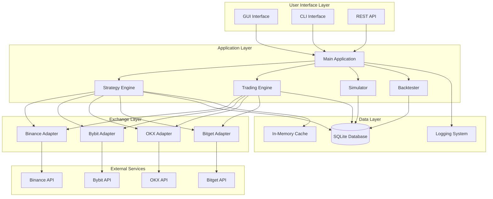

# Architecture Overview

ArBot is designed with a modular, asynchronous architecture that ensures scalability, maintainability, and high performance for real-time arbitrage trading.

## System Architecture



## Core Components

### 1. Main Application (`main.py`)

**Purpose**: Orchestrates all system components and manages application lifecycle.

**Responsibilities**:
- Configuration loading and validation
- Component initialization and dependency injection
- Application state management
- Graceful shutdown handling

**Key Classes**:
```python
class ArBot:
    def __init__(self, config: Config)
    async def initialize(self)
    async def start(self)
    async def stop(self)
    def _validate_config(self)
```

### 2. Strategy Engine (`strategy.py`)

**Purpose**: Core arbitrage detection and signal generation.

**Architecture**:
```python
class ArbitrageStrategy:
    # Data management
    exchange_data: Dict[str, Dict[str, ExchangeData]]
    recent_signals: deque
    
    # Signal processing
    async def _on_ticker_update(self, ticker: Ticker)
    async def _check_arbitrage_opportunities(self, symbol: str)
    def _calculate_arbitrage(self, buy_exchange, sell_exchange)
    
    # Lifecycle management
    async def initialize(self, exchanges)
    async def start(self)
    async def stop(self)
```

**Data Flow**:
1. Receive ticker updates from exchanges
2. Store in structured data format
3. Calculate arbitrage opportunities
4. Apply filters (trend, risk, etc.)
5. Generate trading signals
6. Notify subscribers

### 3. Exchange Adapters (`exchanges/`)

**Purpose**: Standardized interface to different cryptocurrency exchanges.

**Base Interface**:
```python
class BaseExchange(ABC):
    @abstractmethod
    async def connect_ws(self)
    
    @abstractmethod
    async def get_orderbook(self, symbol: str)
    
    @abstractmethod
    async def place_order(self, symbol: str, side: OrderSide, 
                         amount: float, price: float)
    
    @abstractmethod
    async def cancel_order(self, order_id: str)
    
    @abstractmethod
    async def get_balance(self)
    
    @abstractmethod
    async def get_trading_fees(self, symbol: str)
```

**Implementation Pattern**:
```python
class BinanceExchange(BaseExchange):
    def __init__(self, config: ExchangeConfig):
        self.config = config
        self.ws_client = None
        self.rest_client = None
        self.callbacks = []
    
    async def connect_ws(self):
        # WebSocket connection logic
        pass
    
    def on_ticker(self, callback):
        self.callbacks.append(callback)
```

### 4. GUI Interface (`gui.py`)

**Purpose**: User interface for monitoring and controlling the trading bot.

**Architecture Components**:
- **Main Dashboard**: Real-time price monitoring
- **Settings Panels**: Configuration management
- **Data Export**: Historical data extraction
- **Control Interface**: Start/stop trading operations

**Key Features**:
```python
class TradingBotGUI:
    # UI Components
    def create_widgets(self)
    def create_price_monitoring_table(self)
    def create_settings_panel(self)
    
    # Data Management
    def update_price_display(self)
    def handle_arbitrage_signal(self, signal)
    
    # Event Handling
    def start_trading(self)
    def stop_trading(self)
    def export_data(self)
```

### 5. Database Layer (`database.py`)

**Purpose**: Persistent storage for all trading data and analytics.

**Schema Design**:
```sql
-- Core tables
CREATE TABLE tickers (
    id INTEGER PRIMARY KEY,
    exchange TEXT,
    symbol TEXT,
    bid REAL,
    ask REAL,
    timestamp REAL
);

CREATE TABLE arbitrage_opportunities (
    id INTEGER PRIMARY KEY,
    symbol TEXT,
    buy_exchange TEXT,
    sell_exchange TEXT,
    profit_percent REAL,
    timestamp REAL
);

CREATE TABLE trades (
    id INTEGER PRIMARY KEY,
    symbol TEXT,
    side TEXT,
    amount REAL,
    price REAL,
    exchange TEXT,
    timestamp REAL,
    status TEXT
);
```

**Data Access Layer**:
```python
class Database:
    async def insert_ticker(self, ticker: TickerRecord)
    async def insert_arbitrage_opportunity(self, opportunity)
    async def insert_trade(self, trade: TradeRecord)
    async def get_historical_data(self, symbol, start_date, end_date)
    async def cleanup_old_data(self, max_age_days)
```

## Design Patterns

### 1. Observer Pattern

**Implementation**: Signal/callback system for real-time data distribution.

```python
# Strategy notifies multiple subscribers
class ArbitrageStrategy:
    def add_signal_callback(self, callback):
        self.signal_callbacks.append(callback)
    
    async def _handle_arbitrage_opportunity(self, signal):
        for callback in self.signal_callbacks:
            await callback(signal)

# GUI subscribes to strategy signals
gui.strategy.add_signal_callback(gui.handle_arbitrage_signal)
```

### 2. Adapter Pattern

**Implementation**: Standardized exchange interfaces.

```python
# Each exchange adapter implements the same interface
exchanges = {
    'binance': BinanceExchange(config.exchanges['binance']),
    'bybit': BybitExchange(config.exchanges['bybit']),
    'okx': OKXExchange(config.exchanges['okx'])
}

# Strategy works with any exchange through common interface
for exchange_name, exchange in exchanges.items():
    await exchange.connect_ws()
    exchange.on_ticker(self._on_ticker_update)
```

### 3. Strategy Pattern

**Implementation**: Configurable trading strategies and risk management.

```python
class TradingStrategy(ABC):
    @abstractmethod
    def should_execute_trade(self, signal: ArbitrageSignal) -> bool:
        pass

class TrendFilterStrategy(TradingStrategy):
    def should_execute_trade(self, signal: ArbitrageSignal) -> bool:
        return self.check_trend_conditions(signal)

class VolumeFilterStrategy(TradingStrategy):
    def should_execute_trade(self, signal: ArbitrageSignal) -> bool:
        return self.check_volume_conditions(signal)
```

### 4. Factory Pattern

**Implementation**: Dynamic exchange creation based on configuration.

```python
class ExchangeFactory:
    @staticmethod
    def create_exchange(name: str, config: ExchangeConfig) -> BaseExchange:
        exchanges = {
            'binance': BinanceExchange,
            'bybit': BybitExchange,
            'okx': OKXExchange,
            'bitget': BitgetExchange
        }
        
        if name not in exchanges:
            raise ValueError(f"Unsupported exchange: {name}")
        
        return exchanges[name](config)
```

## Asynchronous Architecture

### Event Loop Management

**Single Event Loop**: All asynchronous operations run on the main event loop.

```python
async def main():
    # Initialize components
    config = Config()
    database = Database(config.database.db_path)
    strategy = ArbitrageStrategy(config, database)
    
    # Start all async components
    await asyncio.gather(
        strategy.start(),
        exchange_manager.start(),
        gui.start_async_updates()
    )
```

### Concurrent Data Processing

**WebSocket Handling**: Multiple exchange connections managed concurrently.

```python
async def connect_all_exchanges(self):
    tasks = []
    for exchange_name, exchange in self.exchanges.items():
        if exchange.config.enabled:
            tasks.append(exchange.connect_ws())
    
    await asyncio.gather(*tasks, return_exceptions=True)
```

### Non-Blocking Operations

**Database Operations**: Asynchronous database access prevents blocking.

```python
# Non-blocking database operations
async def store_ticker_data(self, tickers: List[Ticker]):
    async with self.db_pool.acquire() as connection:
        await connection.executemany(
            "INSERT INTO tickers VALUES (?, ?, ?, ?, ?)",
            [(t.exchange, t.symbol, t.bid, t.ask, t.timestamp) 
             for t in tickers]
        )
```

## Error Handling and Resilience

### Graceful Degradation

**Exchange Failures**: System continues operating with available exchanges.

```python
async def handle_exchange_error(self, exchange_name: str, error: Exception):
    logger.error(f"Exchange {exchange_name} error: {error}")
    
    # Disable problematic exchange temporarily
    self.exchanges[exchange_name].enabled = False
    
    # Continue with remaining exchanges
    if len(self.get_active_exchanges()) > 1:
        logger.info("Continuing with remaining exchanges")
    else:
        logger.error("Insufficient exchanges, stopping trading")
        await self.stop()
```

### Automatic Recovery

**Reconnection Logic**: Automatic reconnection with exponential backoff.

```python
async def reconnect_with_backoff(self, exchange: BaseExchange):
    max_retries = 5
    base_delay = 1.0
    
    for attempt in range(max_retries):
        try:
            await exchange.connect_ws()
            logger.info(f"Reconnected to {exchange.name}")
            break
        except Exception as e:
            delay = base_delay * (2 ** attempt)
            logger.warning(f"Reconnection attempt {attempt + 1} failed, "
                          f"retrying in {delay}s")
            await asyncio.sleep(delay)
```

### Data Integrity

**Transaction Management**: Ensure data consistency during failures.

```python
async def execute_arbitrage_trade(self, signal: ArbitrageSignal):
    async with self.database.transaction():
        try:
            # Record trade attempt
            trade_id = await self.database.insert_trade_attempt(signal)
            
            # Execute orders
            buy_order = await self.place_buy_order(signal)
            sell_order = await self.place_sell_order(signal)
            
            # Update trade record
            await self.database.update_trade_success(trade_id, 
                                                   buy_order, sell_order)
            
        except Exception as e:
            # Rollback on any failure
            await self.database.rollback()
            logger.error(f"Trade execution failed: {e}")
            raise
```

## Performance Optimizations

### Memory Management

**Efficient Data Structures**: Use appropriate collections for performance.

```python
# Use deque for sliding windows
self.recent_prices = deque(maxlen=100)

# Use dict for fast lookups
self.symbol_cache = {}

# Use sets for membership testing
self.active_symbols = set()
```

### CPU Optimization

**Vectorized Operations**: Use numpy for numerical computations.

```python
import numpy as np

# Efficient moving average calculation
def calculate_moving_average(self, prices: deque) -> float:
    if len(prices) < self.window_size:
        return None
    
    # Convert to numpy array for efficient computation
    price_array = np.array(prices)
    return np.mean(price_array)
```

### Network Optimization

**Connection Pooling**: Reuse HTTP connections for REST API calls.

```python
class ExchangeClient:
    def __init__(self):
        self.session = aiohttp.ClientSession(
            connector=aiohttp.TCPConnector(limit=100),
            timeout=aiohttp.ClientTimeout(total=30)
        )
```

## Security Considerations

### API Key Management

**Environment Variables**: Store sensitive data outside code.

```python
class ExchangeConfig:
    def __init__(self):
        self.api_key = os.getenv(f"{self.name.upper()}_API_KEY")
        self.api_secret = os.getenv(f"{self.name.upper()}_API_SECRET")
        
        if not self.api_key or not self.api_secret:
            raise ValueError(f"Missing API credentials for {self.name}")
```

### Input Validation

**Data Sanitization**: Validate all external inputs.

```python
def validate_trading_signal(self, signal: ArbitrageSignal) -> bool:
    checks = [
        signal.profit_percent > 0,
        signal.profit_percent < self.config.max_profit_threshold,
        signal.buy_price > 0,
        signal.sell_price > signal.buy_price,
        signal.timestamp > time.time() - self.config.max_signal_age
    ]
    return all(checks)
```

### Rate Limiting

**API Rate Limiting**: Respect exchange rate limits.

```python
from asyncio import Semaphore

class RateLimiter:
    def __init__(self, max_requests: int, time_window: float):
        self.semaphore = Semaphore(max_requests)
        self.time_window = time_window
    
    async def acquire(self):
        await self.semaphore.acquire()
        # Release after time window
        asyncio.create_task(self._release_after_delay())
    
    async def _release_after_delay(self):
        await asyncio.sleep(self.time_window)
        self.semaphore.release()
```

!!! tip "Architecture Benefits"
    - **Modularity**: Easy to add new exchanges or strategies
    - **Scalability**: Asynchronous design handles multiple data streams
    - **Maintainability**: Clear separation of concerns
    - **Testability**: Interface-based design enables comprehensive testing
    - **Resilience**: Multiple layers of error handling and recovery